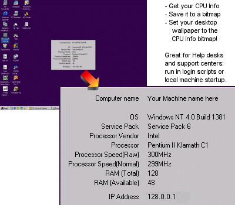

## Collect Sys Info, convert it to a bitmap and set it as desktop wallpaper\!

### Description

This app will collect your system information, save it to a bitmap and then set your desktop wallpaper to the system info bitmap. This is an excellent tool for support centres to aid with information gathering when a client PC and/or application is not behaving.

There's a lot of code here:

Collect CPU info

Get IP Address (no winsock)

Capture the screen

Save a bitmap

Set the desktop wallpaper bitmap

Set the desktop wallpaper tiling off

Refresh the desktop

All this code is extractable for your own uses.

This app requires GetCPU.dll. I have included it in the zip (renamed to GetCPU.txt - I wonder if PSC will allow it - simply rename it from txt to dll and place it in c:\windows or winnt\system32\).

Please vote and comment.
 
### More Info
 

             |
---                |---
**Submitted On**   |2003-03-14 11:11:14
**By**             |[Fosters](https://github.com/Planet-Source-Code/PSCIndex/blob/master/ByAuthor/fosters.md)
**Level**          |Advanced
**User Rating**    |5.0 (15 globes from 3 users)
**Compatibility**  |VB 4\.0 \(32\-bit\), VB 5\.0, VB 6\.0
**Category**       |[Complete Applications](https://github.com/Planet-Source-Code/PSCIndex/blob/master/ByCategory/complete-applications__1-27.md)
**World**          |[Visual Basic](https://github.com/Planet-Source-Code/PSCIndex/blob/master/ByWorld/visual-basic.md)
**Archive File**   |[Collect\_Sy159605632003\.zip](https://github.com/Planet-Source-Code/fosters-collect-sys-info-convert-it-to-a-bitmap-and-set-it-as-desktop-wallpaper__1-45926/archive/master.zip)

